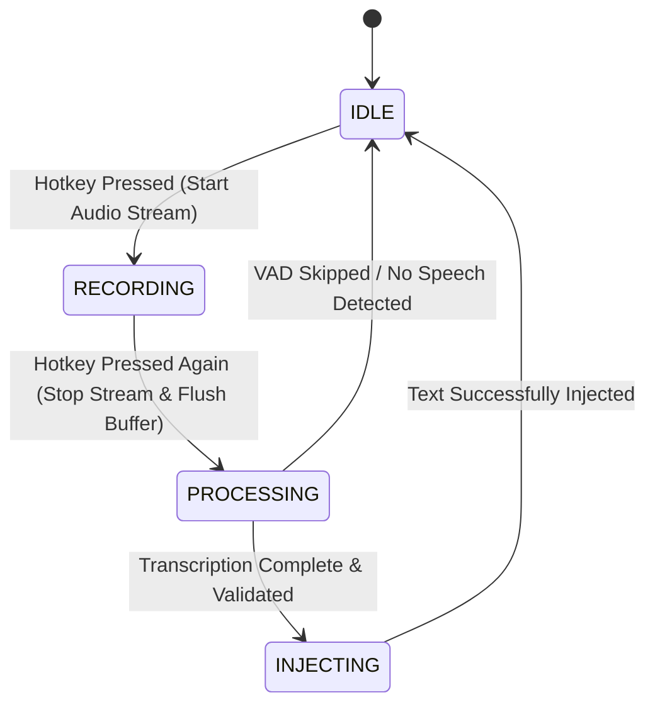

# System Specification: Bol Radha Bol

**A Cross-Platform, System-Wide Dictation Engine**

## 1. Executive Summary & Vision

**Bol Radha Bol** is an open-source, system-wide, keyboard-driven dictation engine designed primarily for Windows and Linux, with extensibility for macOS. Built to replicate and improve upon the seamless workflow of proprietary tools like Wispr Flow and Superwhisper, it allows users to dictate text directly into any application without breaking focus or manually managing clipboards.

**The Core Workflow:**

1. User presses a global shortcut anywhere in the OS (IDE, terminal, browser, Slack).
2. Voice is captured via zero-latency, thread-safe buffering.
3. Audio is transcribed via local edge AI (offline) or ultra-fast cloud APIs (online).
4. Formatted text is injected natively into the active UI element, bypassing the clipboard and without stealing window focus.

---

## 2. Requirements Specification

### 2.1 Functional Requirements (FR)

* **FR-1: Global Hotkey Hook**
System-wide key detection (default `Ctrl+Shift+Space`) that operates in toggle or push-to-talk modes without intercepting or blocking standard OS key combinations.
* **FR-2: Thread-Safe Audio Ingestion**
Continuous 16 kHz mono audio capture, buffered asynchronously into memory with strict mutex/lock protection to prevent thread collisions.
* **FR-3: Dual-Mode Transcription Engine**
* *Online (Default):* Direct API integrations (e.g., Groq, OpenAI Whisper) to guarantee sub-second responses on lower-spec hardware.
* *Offline (Optional):* Utilizes `faster-whisper` (CTranslate2, int8/float16) paired with Silero VAD (Voice Activity Detection) to strip ambient noise and process speech locally.


* **FR-4: Context-Agnostic Text Injection**
* *Windows:* Employs low-level Win32 `SendInput` (`KEYEVENTF_UNICODE`) to simulate hardware keystrokes, ensuring compatibility with strict environments like command prompts, Electron apps, and video games.
* *Linux:* Leverages Wayland kernel injection via `ydotool` and X11 via `xdotool`, with `wl-copy` clipboard pasting as a reliable fallback.


* **FR-5: Floating Status Overlay**
A lightweight, non-focus-stealing visual indicator (e.g., Recording 🔴 | Processing ⏳ | Ready 🟢) placed unobtrusively on the screen edge or near the cursor.

### 2.2 Non-Functional Requirements (NFR)

* **NFR-1 (Latency):** Time-to-text must remain under 1.5 seconds for average-length sentences.
* **NFR-2 (Resource Footprint):** Idle memory consumption must remain below 100 MB, with near-zero CPU utilization when not actively recording or processing.
* **NFR-3 (Modularity):** The codebase must strictly adhere to the Ports & Adapters (Hexagonal) architecture. Core business logic will have absolute zero coupling to OS-specific APIs.

---

## 3. Architecture Overview (Ports & Adapters)

The system isolates the "brain" of the app from the physical hardware limits of the operating system using Interface Contracts (Ports).

```mermaid
flowchart TD
    subgraph Core ["Common Core (Platform Agnostic)"]
        Buffer["AudioBuffer (Thread-Safe Queue)"]
        Orchestrator["DictationOrchestrator (State Machine)"]
        PostProc["PostProcessor (Formatting)"]

        Buffer <--> Orchestrator
        Orchestrator --> PostProc
    end

    subgraph Ports ["Interface Contracts (Ports)"]
        IAudio["IAudioCapture"]
        IInference["IInferenceEngine"]
        IInjector["ITextInjector"]
        IUI["IUIIndicator"]
    end

    subgraph Adapters ["Platform & Engine Adapters"]
        WinAudio["Windows: sounddevice / WASAPI"]
        LinAudio["Linux: sounddevice / ALSA / Pulse"]

        LocalWhisper["Offline: faster-whisper (CTranslate2)"]
        CloudWhisper["Online: Groq / OpenAI"]

        WinInject["Windows: Win32 SendInput"]
        LinInject["Linux: ydotool / xdotool"]

        Overlay["UI: Floating Status Pill"]
    end

    Orchestrator -.-> IAudio
    Orchestrator -.-> IInference
    Orchestrator -.-> IInjector
    Orchestrator -.-> IUI

    IAudio <|-- WinAudio
    IAudio <|-- LinAudio
    IInference <|-- LocalWhisper
    IInference <|-- CloudWhisper
    IInjector <|-- WinInject
    IInjector <|-- LinInject
    IUI <|-- Overlay

```

---

## 4. Application State Machine

The dictation pipeline is strictly governed by a unidirectional state machine to prevent race conditions between audio capture and hardware injection.



---

## 5. Repository Structure Blueprint

```text
bol-radha-bol/
├── core/
│   ├── __init__.py
│   ├── interfaces.py          # Port definitions (IAudioCapture, IInferenceEngine, etc.)
│   ├── audio_buffer.py        # Thread-safe chunk buffer
│   ├── orchestrator.py        # State machine & pipeline coordinator
│   └── post_processor.py      # Capitalization, whitespace, and formatting
│
├── adapters/
│   ├── __init__.py
│   ├── ai/
│   │   ├── __init__.py
│   │   ├── whisper_engine.py  # Local faster-whisper implementation
│   │   └── cloud_engine.py    # Cloud API implementation (Groq/OpenAI)
│   ├── windows/
│   │   ├── __init__.py
│   │   ├── audio_capture.py   # sounddevice / WASAPI adapter
│   │   ├── text_injector.py   # Win32 SendInput adapter
│   │   └── hotkey_listener.py # Global keyboard hook adapter
│   ├── linux/
│   │   ├── __init__.py
│   │   ├── audio_capture.py   # Linux audio adapter
│   │   ├── text_injector.py   # ydotool / xdotool adapter
│   │   └── hotkey_listener.py # evdev / pynput adapter
│   └── ui/
│       ├── __init__.py
│       └── indicator.py       # Minimal floating status pill
│
├── config.py                  # Settings (model size, hotkeys, online/offline toggles)
├── requirements.txt           # Python dependencies
└── main.py                    # OS detection & dependency-injected bootstrap

```

---

## 6. Phased Implementation Roadmap

* **Phase 1: Common Core Framework**
Build the OS-agnostic brain. Implement `core/interfaces.py`, `core/audio_buffer.py`, and `core/orchestrator.py` to handle the data flow and state machine.
* **Phase 2: Windows Adapters & End-to-End Pipeline**
Develop the physical connections for Windows. Build `adapters/windows/text_injector.py` (Win32 SendInput), audio capture, and local `faster-whisper` AI engine. Wire it through `main.py` for the first functional test.
* **Phase 3: UX & Text Polishing**
Build the non-intrusive floating indicator overlay. Implement the `PostProcessor` to handle punctuation, trailing whitespace logic, and intelligent capitalization.
* **Phase 4: Linux Support & Packaging**
Implement Linux adapters (`ydotool` / `xdotool`). Finalize standalone deployment scripts (e.g., PyInstaller or an integrated Tauri bundle) for easy distribution.